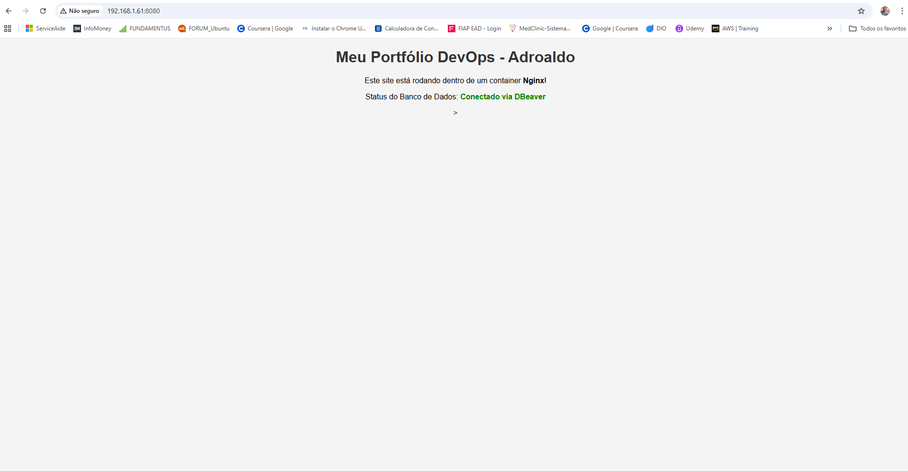
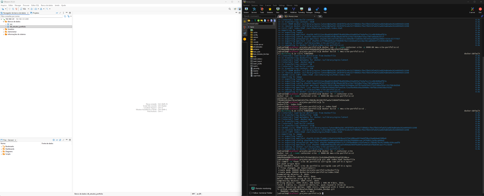

# Lab: Servidor Nginx e MySQL com Docker

Este laboratório tem a intenção de demonstra a criação de um ambiente conteinerizado para um portfólio pessoal, com foco em troubleshooting e redes.
Trata-se de duas situação, o primeiro foi a criação de um banco usando o Mysql e gerenciado com o Dbeaver, já o segundo foi utilizado para um servidor web, com o Nginx e exibindo apágina personalizada.

## 🛠️ Tecnologias Utilizadas

* **Docker**: Build de imagens e gerenciamento de containers.
* **Nginx**: Servidor web para hospedar o portfólio.
* **MySQL**: Banco de dados relacional.
* **DBeaver**: Gestão de dados externa via rede.

## 🔧 Troubleshooting Realizado

Durante o desenvolvimento, foi identificado um erro de codificação (charset) na renderização de caracteres especiais. O problema foi resolvido adicionando a tag `<meta charset="UTF-8">` ao `index.html`.

## 🚀 Como Executar

1. **Build da imagem**: `docker build -t meu-site-portfolio:v3 .`
2. **Execução**: `docker run -d --name container-site -p 8080:80 meu-site-portfolio:v3`

---

### 📸 Evidências do Projeto

#### Resultado da Página Web

#### Resultado Final e Troubleshooting

